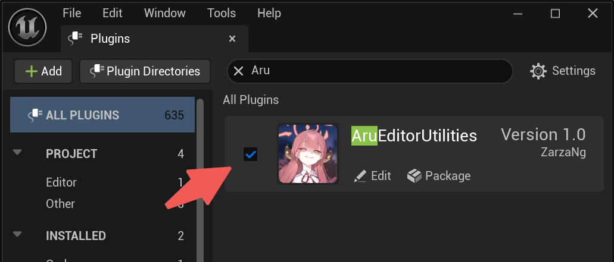

# PropFlow Catalyst
  


PropFlow Catalyst is a Unreal Engine plugin that facilitates the bulk configuration of assets based on the assetisation of the configuration process.

## ✨Features
- **Rule-Driven Attribute Batch Modification**: Modify multiple attributes in bulk using predefined rule templates, eliminating manual repetition.
- **Configuration Pipeline Assetization**: Save complete configuration workflows as version-controlled, shareable assets.
- **Modular Configuration Design**: Split large configuration tables into independent modules to reduce maintenance complexity.

## 🕹Getting Started

### 📥 Installation
1. **Download the Plugin**  
   - Clone this repository:  
     ```bash
     https://github.com/ZarzaNg/AruEditorUtilities.git
     ```
   - Or [download as a ZIP](https://github.com/ZarzaNg/AruEditorUtilities/archive/refs/heads/main.zip) and extract it.

2. **Install to Your Project**  
   - Copy the entire plugin folder to your project's `Plugins/` directory:  
     ```
     YourProject/  
     └── Plugins/  
         └── # Paste the downloaded plugin here
     ```

3. **Enable the Plugin**  
   - Open your project in the editor.  
   - Edit > Plugins, find this plugin and enable. 
