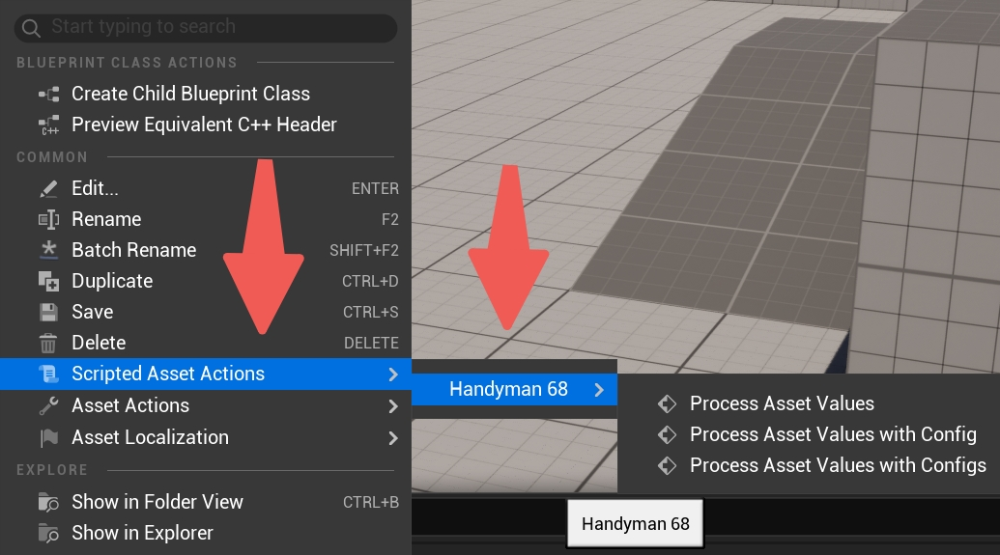
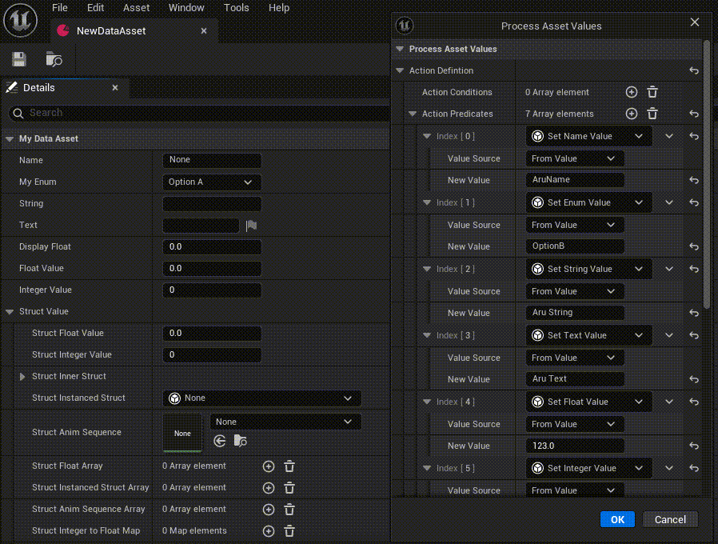
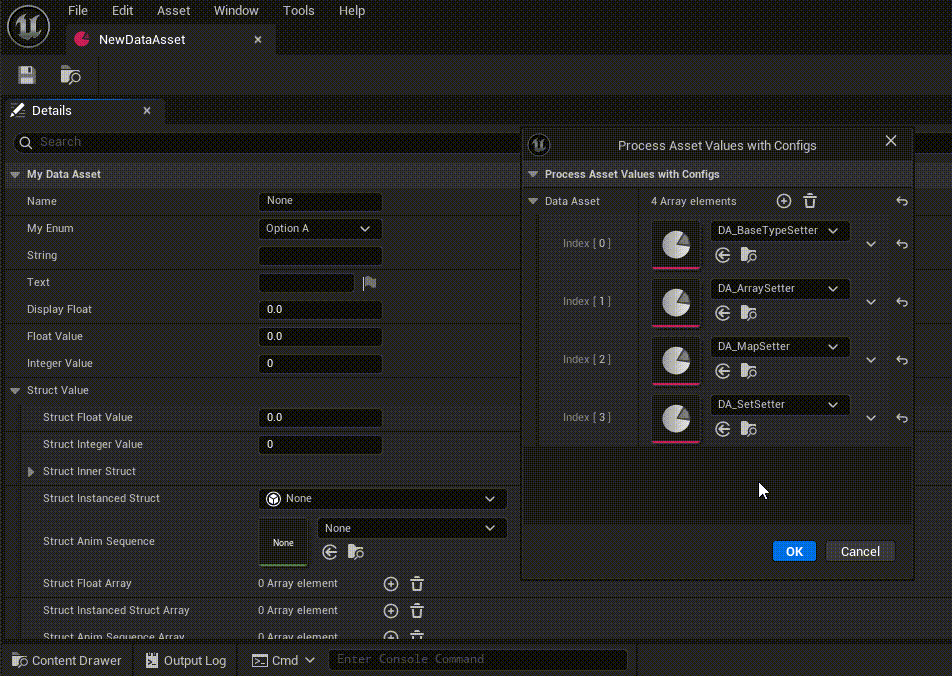

# PropFlow Catalyst
  


PropFlow Catalyst is a Unreal Engine plugin that facilitates the bulk configuration of assets based on the assetisation of the configuration process.

## ✨Features
- **Rule-Driven Attribute Batch Modification**: Modify multiple attributes in bulk using predefined rule templates, eliminating manual repetition.
- **Configuration Pipeline Assetization**: Save complete configuration workflows as version-controlled, shareable assets.
- **Modular Configuration Design**: Split large configuration tables into independent modules to reduce maintenance complexity.

## 🕹Getting Started

### 📥 Installation
1. **Download the Plugin**  
   - Clone this repository:  
     ```bash
     https://github.com/ZarzaNg/AruEditorUtilities.git
     ```
   - Or [download as a ZIP](https://github.com/ZarzaNg/AruEditorUtilities/archive/refs/heads/main.zip) and extract it.

2. **Install to Your Project**  
   - Copy the entire plugin folder to your project's `Plugins/` directory:  
     ```
     YourProject/  
     └── Plugins/  
         └── # Paste the downloaded plugin here
     ```

3. **Enable the Plugin**  
   - Open your project in the editor.  
   - Edit → Plugins, find this plugin and enable. 
  
### 🛠️ Usage
1. **Access Asset Actions**
   - Right-click on any asset you want to edit in your project's content browser.  
   - Navigate to the context menu: **ScriptedAssetActions → Handyman 68** 

2. **Choose Operation Mode**  
   - 🔥 **Quick Operation**  
     - Select `Process Asset Values` from submenu  
     - In the popup window:  
       1️⃣ **Setup Conditions** - Define filtering rules (e.g. "Does property name match?")  
       2️⃣ **Setup Actions** - Choose processing method (e.g. "Set new value to property.")  
       3️⃣ **Execute** - Applies to all selected assets matching conditions


   - 📁 **Preset DataAsset Workflow**  
     - Prepare preset DataAssets containing preconfigured:  
       - `Conditions` (Asset filtering logic)  
       - `Actions` (Processing sequence)  
     - Select `Process Asset Values with Configs` from submenu  
     - Choose your prebuilt data asset from file picker  
     - System will automatically validate and execute the workflow

    
▶️ **Recommendation**  
- Start with Quick Operation for single-batch tasks  
- Use DataAsset presets for recurring complex workflows

⚠️ **Note**:
- Always verify filter conditions before execution, a condition like "PropertyName=MyFloat" will include all the properties named "MyFloat" in different scopes.
- Use version control diff tools to inspect modifications.
